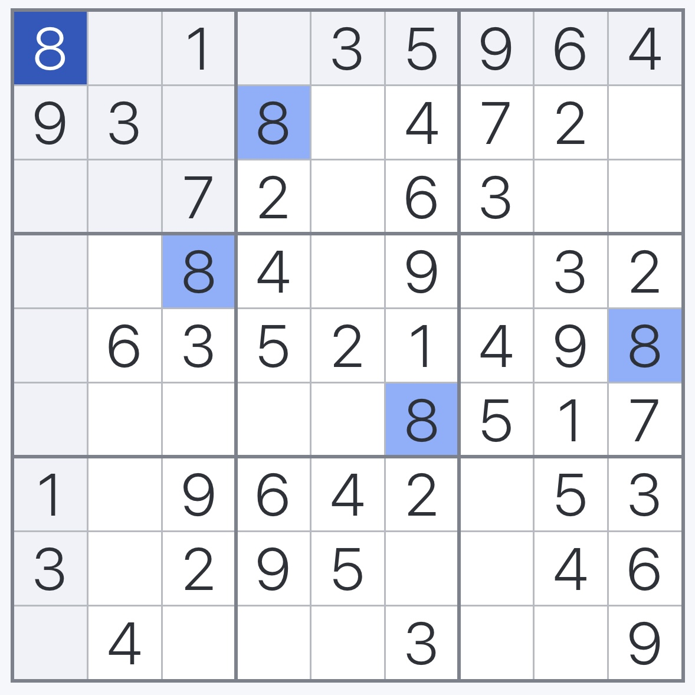
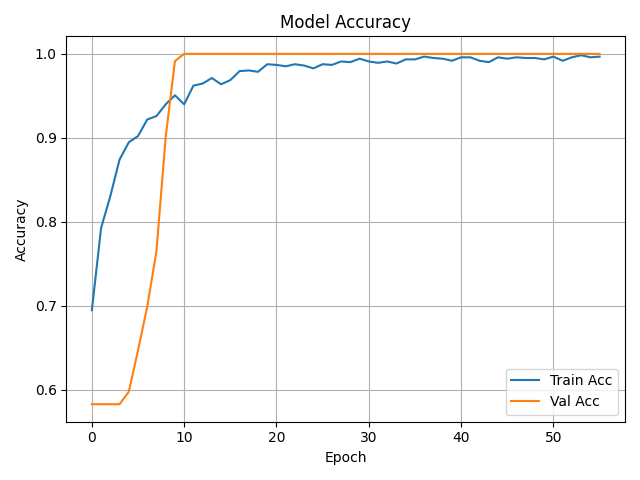
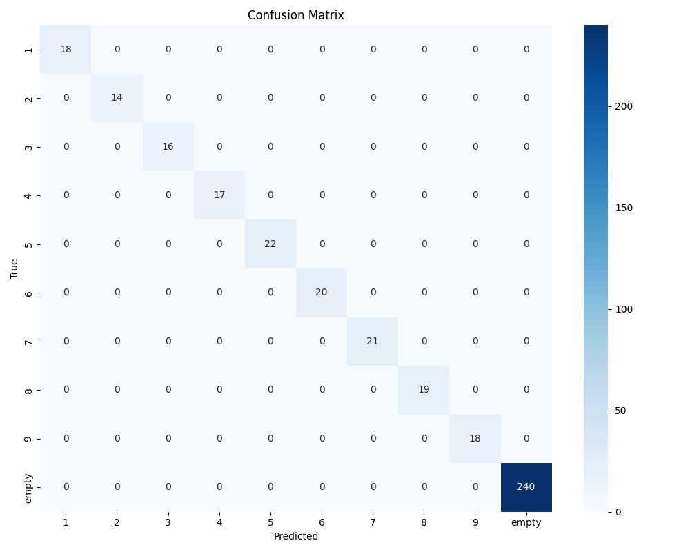

# AISudokuSolver: Computer Vision-Based (CNN) Sudoku Solver  and LLM Trace Analysis


A pipeline to solve Sudoku puzzles from images, using computer vision for digit extraction, a backtracking algorithm for solving, and LLMs for analytical summaries.  

---

## Author

Íñigo Rodríguez Sánchez  
AI & Data Engineer

---

## Table of Contents

- [Introduction](#introduction)
- [Key Features](#key-features)
- [Project Structure](#project-structure)
- [Script Overview](#script-overview)
- [Tests & Coverage](#tests--coverage)
- [System Workflow](#system-workflow)
- [Computer Vision & Digit Recognition](#computer-vision--digit-recognition)
- [Installation](#installation)
- [Usage](#usage)
- [Important Notes](#important-notes)
- [Final Words](#final-words)

---

## Introduction

AISudokuSolver is a fully autonomous pipeline that solves Sudoku puzzles from images, integrating computer vision, deep learning, and symbolic reasoning.

The system extracts and interprets the puzzle board from a photo or scan using a custom-trained Convolutional Neural Network (CNN) for digit recognition. The board is then solved using an optimized backtracking algorithm enhanced with constraint propagation and variable ordering heuristics.

In addition to solving the puzzle, AISudokuSolver records a detailed trace of the resolution process and generates a structured Markdown report enriched with a natural language summary powered by a Large Language Model (LLM). This summary interprets the solving strategy, highlights key decisions, and estimates puzzle complexity.

The project is designed as a robust, testable, and educational framework that combines traditional algorithmic techniques with modern AI capabilities. It is ideal for exploring computer vision pipelines, algorithm design, and LLM-based analytics in a real-world use case.

---

## Key Features

- **End-to-End Sudoku Solving Pipeline**: Processes input images, extracts puzzles, solves them, and generates full analytical reports.
- **CNN-Based Digit Recognition**: Classifies digits (1–9) and empty cells using a trained Convolutional Neural Network.
- **Optimized Backtracking Solver**: Uses constraint propagation and MRV heuristic for efficient solving.
- **Trace Generation**: Records every solving step to produce a detailed and reproducible trace.
- **LLM-Powered Summary**: Generates a natural language explanation of the solving strategy using GPT-based models.
- **Markdown Reporting**: Produces structured reports with boards, trace, metrics, and LLM insights.
- **Modular and Maintainable Architecture**: Decoupled components for vision, logic, and reporting, each independently testable.
- **FastAPI Server Support**: Exposes the solver as a local REST API for integration into other systems or workflows.

---

## Project Structure

The project is organized into modular components to ensure clarity, maintainability, and testability. Below is the high-level directory structure with key roles explained:

```bash
ai-sudoku-solver/
├── cnn_classifier/                # CNN model: training, evaluation and digit prediction
│   ├── model/                     # Saved CNN model in .keras format
│   ├── results/                   # Evaluation metrics, confusion matrix, and logs
│   ├── digit_classifier.py        # Loads trained CNN and classifies digits (0–9 or empty)
│   ├── evaluate_model.py          # Evaluates CNN on the test dataset
│   ├── extrac_cells.py            # Segments Sudoku image into 81 raw grayscale cells
│   └── train_model.py             # Trains the CNN on labeled digit images
│
├── datasets/                      # Digit dataset folders for CNN training and validation
│   ├── raw/                       # Raw segmented cells (unlabeled)
│   ├── sudokus/                   # Full Sudoku images for segmentation
│   ├── train/                     # Training images (classified digits)
│   ├── val/                       # Validation images
│   └── test/                      # Test images
│
├── inputs/                        # Sample Sudoku images (e.g., easy.jpg, medium.jpg)
│   └── easy.jpg, medium.jpg, etc.
│
├── outputs/                       # Reports and traces generated by the pipeline (example)
│   ├── *_console.log              # Console output during solving
│   ├── *_solution_trace.json      # JSON trace of the solving steps
│   ├── *_input.jpg/png            # Input sudoku image
│   └── *_REPORT.md                # Markdown report with solving summary and trace
│
├── readme_images/                 # Images used in README.md (documentation only)
│   ├── 5_cell.jpg
│   ├── empty_cell.jpg
│   └── sudoku.jpg
│
├── solver/                        # Sudoku solving logic
│   └── bckt_logic_solver.py       # Optimized backtracking algorithm with MRV & forward checking
│
├── src/                           # Source scripts
│   └── aisudokusolver.py          # Main script: solves Sudoku from image input and generates report
│
├── tests/                         # PyTest test suite (unit tests)
│   ├── resources/                 # Input images for testing
│   ├── test_ai_summarizer.py      # Tests for LLM summarizer output
│   ├── test_classifier.py         # Tests digit classifier predictions
│   ├── test_image_parser.py       # Tests image-to-board parsing pipeline
│   ├── test_print_board.py        # Tests pretty print of Sudoku boards
│   ├── test_reporter.py           # Tests Markdown report generation
│   ├── test_segmented_board.py    # Validates board segmentation
│   ├── test_solver.py             # Tests solver logic
│   └── test_user_input.py         # Tests GUI input flow
│
├── utils/                         # Utility scripts and shared logic
│   ├── ai_summarizer.py           # Summarizes solving trace using OpenAI API
│   ├── config.py                  # Shared configuration (paths, constants)
│   ├── logs_config.py             # Logging setup and formatting
│   ├── print_board.py             # Pretty-prints Sudoku board to console
│   ├── reporter.py                # Builds Markdown report and trace file
│   └── user_input.py              # GUI for file selection (CLI)
│
├── vision/                        # Computer vision preprocessing and board detection
│   ├── board_segmenter.py         # Locates and crops Sudoku grid from image
│   └── image_parser.py            # Segments and classifies cells into a 9x9 matrix
│
├── .gitignore                     # Git ignore rules
├── app.py                         # FastAPI server exposing the pipeline as an HTTP API
├── README.md                      # Project documentation
└── requirements.txt               # Python package dependencies
```

---

## Script Overview

| Script / Module                        | Description                                                                 |
|----------------------------------------|-----------------------------------------------------------------------------|
| **cnn_classifier/digit_classifier.py** | Loads the trained CNN model and classifies digit cells                      |
| **cnn_classifier/evaluate_model.py**   | Evaluates the model on test data and saves performance metrics              |
| **cnn_classifier/extrac_cells.py**     | Extracts 81 cell images from Sudoku board for labeling                      |
| **cnn_classifier/train_model.py**      | Trains the CNN on labeled digits and empty cells                            |
| **solver/bckt_logic_solver.py**        | Backtracking Sudoku solver with MRV & forward checking optimizations        |
| **src/aisudokusolver.py**              | CLI entry point: solves Sudoku from image and generates report              |
| **utils/ai_summarizer.py**             | Generates a natural language summary using the solving trace (via OpenAI)   |
| **utils/config.py**                    | Defines shared paths and configuration constants                            |
| **utils/logs_config.py**               | Logger setup and formatting                                                 |
| **utils/print_board.py**               | Utility to pretty-print Sudoku boards to console                            |
| **utils/reporter.py**                  | Saves solution trace and generates Markdown report                          |
| **utils/user_input.py**                | GUI file selector utility (used in CLI)                                     |
| **vision/board_segmenter.py**          | Detects and isolates the Sudoku grid from an image                          |
| **vision/image_parser.py**             | Full image-to-matrix pipeline: segmentation + digit classification          |
| **app.py**                             | FastAPI server exposing the solving pipeline as a REST API                  |

---

## Tests & Coverage


AISudokuSolver includes a comprehensive test suite covering all critical components of the solving pipeline: from image parsing to CNN classification and logic-based solving.

All key modules are covered by unit tests using `pytest` and `pytest-cov`, ensuring high reliability and consistent performance.

| Test File                         | Description                                                       |
|-----------------------------------|-------------------------------------------------------------------|
| `tests/test_ai_summarizer.py`     | Tests OpenAI-based summarization of the solving trace.            |
| `tests/test_classifier.py`        | Validates CNN model predictions for digit classification.         |
| `tests/test_image_parser.py`      | Tests full OCR pipeline from image to 9x9 board matrix.           |
| `tests/test_print_board.py`       | Ensures proper formatted printing of Sudoku boards to console.    |
| `tests/test_reporter.py`          | Verifies Markdown report and solving trace generation.            |
| `tests/test_segmented_board.py`   | Confirms board segmentation always returns exactly 81 cells.      |
| `tests/test_solver.py`            | Tests backtracking algorithm on solvable and unsolvable boards.   |
| `tests/test_user_input.py`        | Simulates GUI input flow using Tkinter dialog.                    |

Once the full suite is executed, the following results were obtained from the latest full test run on the main branch:

```bash
 pytest --cov=. --cov-report=term-missing --cov-report=html

========================================================== tests coverage ==========================================================
_________________________________________ coverage: platform darwin, python 3.11.9-final-0 _________________________________________

Name                                 Stmts   Miss  Cover   Missing
------------------------------------------------------------------
aisudokusolver.py                       71     71     0%   23-173
app.py                                  41     41     0%   18-130
cnn_classifier/digit_classifier.py      19      0   100%
solver/__init__.py                       0      0   100%
solver/bckt_logic_solver.py             86      1    99%   210
tests/__init__.py                        0      0   100%
tests/test_ai_summarizer.py             24      0   100%
tests/test_classifier.py                 7      0   100%
tests/test_image_parser.py               7      0   100%
tests/test_print_board.py                8      0   100%
tests/test_reporter.py                  31      0   100%
tests/test_segmented_board.py            7      0   100%
tests/test_solver.py                    11      0   100%
tests/test_user_input.py                19      0   100%
utils/__init__.py                        0      0   100%
utils/ai_summarizer.py                  20      0   100%
utils/config.py                          3      0   100%
utils/logs_config.py                     9      0   100%
utils/print_board.py                     9      0   100%
utils/reporter.py                       58      2    97%   129-130
utils/user_input.py                     16      0   100%
vision/__init__.py                       0      0   100%
vision/board_segmenter.py               46      2    96%   79, 133
vision/image_parser.py                  18      1    94%   41
------------------------------------------------------------------
TOTAL                                  510    118    77%
Coverage HTML written to dir htmlcov
======================================================= 13 passed in 24.84s ========================================================
```

These tests give confidence that core modules behave reliably across a wide range of inputs, edge cases, and real-world conditions. The test suite ensures that future improvements or refactors won't compromise existing functionality.

---

## System Workflow

The following diagram illustrates the overall data flow within the Sudoku solving pipeline, from image input to final report generation:

```bash
╔=======================================╗
║        Input Image (.jpg/.png)        ║
╚=======================================╝
                  │
                  ▼
╔=======================================╗
║ vision/board_segmenter.py             ║
║   → Detects and warps the grid        ║
║   → Segments image into 81 cells      ║
╚=======================================╝
                  │
                  ▼
╔=======================================╗
║ cnn_classifier/digit_classifier.py    ║
║ → Predicts each cell’s digit (0–9)    ║
║   or identifies it as empty (0)       ║
╚=======================================╝
                  │
                  ▼
╔=======================================╗
║            9x9 Sudoku Grid            ║
╚=======================================╝
                  │
                  ▼
╔=======================================╗
║ solver/bckt_logic_solver.py           ║
║ → Solves using optimized backtracking ║
╚=======================================╝
                  │
                  ▼
╔=======================================╗
║ utils/ai_summarizer.py                ║
║   → Summarizes solving steps with LLM ║
║     (trace-aware explanation)         ║
╚=======================================╝
                  │
                  ▼
╔=======================================╗
║ utils/reporter.py                     ║
║   → Builds full Markdown report       ║
║     + JSON trace + console log        ║
╚=======================================╝
```

The system is modular by design. Each stage is handled by a dedicated component, enabling both flexibility and testability across the pipeline.

---

## Computer Vision & Digit Recognition

This system uses computer vision techniques to extract the Sudoku grid from a photograph and classify its digits using a custom-trained Convolutional Neural Network (CNN). Below is an overview of the full process:

### Input Image → Grid Segmentation

Each input image is processed to detect the outer contour of the Sudoku grid, which is then warped into a perfect square. This grid is divided into 81 individual square cells.

<div align="center">
  
</div>

### Cell Extraction and Labeling

The extracted cells are saved as individual grayscale images (50x50 pixels), ready to be labeled manually into categories: digits 1–9 or empty. These labeled images are later organized into folders for training.

<div align="center">
  
  
</div>

### Dataset Structure

The labeled dataset is organized into three partitions for training, validation, and testing. Each partition contains one folder per digit class (0–9), where `0` represents an empty cell.

| Partition  | Path                  | Digits per Class | Total Images |
|------------|------------------------|------------------|--------------|
| Train      | `datasets/train/`      | ~450             | 4,064        |
| Validation | `datasets/val/`        | ~100             | 912          |
| Test       | `datasets/test/`       | ~100             | 900          |

> Dataset was created by manually labeling extracted cells using `extrac_cells.py` and human review.

### CNN Architecture

The CNN used to classify the digits is defined with the following architecture:

```bash
Input: (50, 50, 1) grayscale image
│
├── Conv2D(32, 3x3, relu)
├── MaxPooling2D(2x2)
├── Dropout(0.25)
│
├── Conv2D(64, 3x3, relu)
├── MaxPooling2D(2x2)
├── Dropout(0.25)
│
├── Flatten()
├── Dense(128, relu)
├── Dropout(0.5)
└── Dense(10, softmax)
```

- **Loss Function:** Categorical Crossentropy  
- **Optimizer:** Adam  
- **Epochs:** 100 (early stopping triggered at epoch 56)  
- **Callbacks:** EarlyStopping and ModelCheckpoint

The trained model is saved in:
```bash
cnn_classifier/model/digit_model.keras
```

### Evaluation Metrics

The final model achieved the following performance:

| Metric                      | Value   |
|-----------------------------|---------|
| Train Accuracy (final)      | 0.9967  |
| Validation Accuracy (final) | 1.0000  |
| Train Loss (final)          | 0.0089  |
| Validation Loss (final)     | 0.0000  |
| Test Accuracy               | 1.0000  |
| Test Loss                   | 0.0000  |

The classifier demonstrates near-perfect performance across all partitions, making it a reliable digit recognizer in the Sudoku solving pipeline.

### Training Visualizations

<div align="center">
  
</div>

### Confusion Matrix

<div align="center">
  
</div>

The confusion matrix confirms that the classifier correctly predicted every single instance in the test set without error.

The classifier demonstrates excellent generalization across cleanly segmented Sudoku cells and is robust for use in the automated solving pipeline.

The model is stored in `cnn_classifier/model/digit_model.keras` and used at runtime to classify new cell images.

---

## Installation

1. Clone this repository:
```bash
git clone https://github.com/YOUR_USERNAME/ai-sudoku-solver.git
cd ai-sudoku-solver
```

2. (Optional but recommended) Create and activate a virtual environment:
```bash
python -m venv .venv
source .venv/bin/activate  # On Windows: .venv\Scripts\activate
```

3. Install required Python packages:
```bash
pip install -r requirements.txt
```

4. Add your OpenAI key on the .env file:
```bash
OPENAI_API_KEY=your_openai_api_key_here
```

---

## Usage

You can use **AISudokuSolver** in two main ways, depending on whether you want an interactive CLI experience or access it programmatically via a local REST API.

### Option 1: Run via CLI (recommended for individual use)

Execute the full solving pipeline by running the main script:

```bash
python aisudokusolver.py
```

You will be prompted to select a Sudoku image (JPG or PNG). The pipeline will:

1. Parse and segment the board from the image. 
2. Use a CNN to classify each cell. 
3. Solve the puzzle using backtracking with MRV & forward checking. 
4. Save the outputs to your Downloads/AISudokuSolver/ folder, including:
   - Input image
   - Markdown report (MD)
   - Solving trace (JSON)
   - Console log (LOG)

### Option 2: Run the FastAPI server locally

Expose the functionality via a local REST API by launching the FastAPI app:
```bash
uvicorn app:app --reload
```

Then open the interactive documentation at:
```bash
http://127.0.0.1:8000/docs
```

You can test the /solve endpoint directly from the Swagger UI, or use curl:
```bash
curl -X 'POST' \
  'http://127.0.0.1:8000/solve' \
  -F 'image=@inputs/easy.jpg' \
  -H 'accept: application/json' \
  -H 'Content-Type: multipart/form-data'
```

A successful response will look like:
```bash
{
  "parsed_board": [[5,3,0,...]],
  "solved_board": [[5,3,4,...]],
  "steps": 34,
  "duration": 0.92
}
```

The complete output files will be saved in your Downloads/AISudokuSolver/ folder.

---

## Important Notes

- The CNN model for digit recognition was trained from scratch using manually labeled Sudoku cell images. You can retrain or improve this model by updating the dataset in `/datasets/train`, `/datasets/val`, and `/datasets/test`.
- Input images must clearly show a front-facing, well-lit Sudoku grid. While the system includes preprocessing steps like resizing, binarization, and grid orientation correction, highly skewed or low-contrast images may lead to errors in segmentation or digit classification.
- The solving algorithm combines an optimized backtracking approach with **Minimum Remaining Value (MRV)** heuristics and **forward checking** for constraint propagation. Only the final placements are included in the solving trace, not the full decision tree.
- To generate the optional LLM-based summary, an OpenAI API key must be provided via a `.env` file:
   ```bash
   OPENAI_API_KEY=your_openai_api_key
   ```
- All reports, traces, and log files are saved under the ~/Downloads/AISudokuSolver/ folder. Each output set is named based on the original input image filename and includes:
  - A .md Markdown report
  - A .json solving trace
  - A .log console output snapshot
- The FastAPI server is currently intended for local usage only. A public deployment for easier external access is planned as a future improvement. This could also include the development of a user-friendly graphical interface.

> This modular pipeline enables easy retraining, debugging, and extension of both the vision and logic components.

---

## Final Words

This project originated from my personal passion for Sudoku puzzles and the challenge of building a system capable of solving them end-to-end — from visual recognition to logical resolution.

It has been designed as a fully autonomous pipeline that blends classic algorithmic techniques with modern AI models.The result is a practical system that combines computer vision, deep learning, and LLM-based interpretation — all within a structured, testable, and reproducible framework.

Feel free to explore, extend, or integrate it into your own applications. Contributions, feedback, or improvements are always welcome.


**If you’ve found this project useful or inspiring — feel free to build on it, break it, or just drop a star 🌟.**

