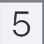

# AISudokuSolver: Computer Vision-Based (CNN) Sudoku Solver  and LLM Trace Analysis


A pipeline to solve Sudoku puzzles from images, using computer vision for digit extraction, a backtracking algorithm for solving, and LLMs for analytical summaries.  

---

## Author

Íñigo Rodríguez Sánchez  
Data & Artificial Intelligence Engineer

---

## Table of Contents

- [Introduction](#introduction)
- [Key Features](#key-features)
- [Project Structure](#project-structure)
- [Script Overview](#script-overview)
- [System Workflow](#system-workflow)
- [Computer Vision & Digit Recognition](#computer-vision--digit-recognition)
- [Installation](#installation)
- [Usage](#usage)
- [Important Notes](#important-notes)
- [Final Words](#final-words)

---

## Introduction

**AISudokuSolver** is a complete image-to-solution pipeline for solving Sudoku puzzles from photos or scans.  
The project combines computer vision techniques (grid segmentation, digit recognition using a trained CNN model) with an optimized backtracking algorithm to solve the extracted board.

In addition to solving the puzzle, the system logs detailed resolution traces and generates a professional Markdown report, enriched with a natural language summary powered by an LLM (Large Language Model) that interprets the solving process.

This tool is ideal for analyzing Sudoku resolution strategies and serves as an educational reference for integrating classical algorithms with modern AI components.

---

## Key Features

- End-to-End Sudoku Solver: From image input to solved board with full trace and report.
- CNN Digit Recognition: Trained Convolutional Neural Network to detect digits from segmented cell images.
- Optimized Backtracking Algorithm: Includes MRV heuristic and forward checking for efficient solving.
- Markdown Reporting: Generates a detailed Markdown report with image, steps, and solution metrics.
- LLM-Based Analysis: Integrates OpenAI to summarize the solving trace and estimate puzzle difficulty.
- Interactive Board Correction: Terminal interface for user-guided manual correction before solving.
- Modular and Testable Design: Easily testable pipeline with structured utilities and PyTest coverage.

---

## Project Structure

The project is organized into modular components to ensure clarity, maintainability, and testability. Below is the high-level directory structure with key roles explained:

```bash
AISudokuSolver/
├── cnn_classifier/                # CNN model: training, evaluation and digit prediction
│   ├── model/                     # Folder containing the saved trained model
│   ├── results/                   # Evaluation metrics, confusion matrix and logs
│   ├── digit_classifier.py        # Loads trained CNN and classifies digits (0–9 or empty)
│   ├── evaluate_model.py          # Evaluates CNN on test dataset and generates metrics
│   ├── extrac_cells.py            # Segments a Sudoku image into 81 raw cells
│   └── train_model.py             # Trains a CNN on labeled digit images
│
├── datasets/                      # Datasets used to train/validate/test the CNN
│   ├── raw/                       # Output of extrac_cells.py – to be manually labeled
│   ├── sudokus/                   # Raw Sudoku images to be segmented
│   ├── test/                      # Labeled data for final evaluation
│   ├── train/                     # Labeled data for training
│   └── val/                       # Labeled data for validation
│
├── images/                        # Images used in README: input sample and extracted cells
│   ├── markdown_sudoku.jpg
│   ├── markdown_5_cell.jpg
│   └── markdown_empty_cell.jpg
│
├── inputs/                        # Sudoku image samples of various difficulties
│   └── easy.jpg, medium.jpg, etc.
│
├── outputs/                       # Reports and traces generated by the pipeline
│   ├── *_console.log              # Console output during solving
│   ├── *_REPORT.md                # Markdown solution report
│   └── *_solution_trace.json      # Final trace (cell-by-cell solving path)
│
├── solver/                        # Core solving algorithm
│   └── bckt_logic_solver.py       # Optimized backtracking with MRV & forward checking
│
├── tests/                         # PyTest unit tests covering critical modules
│   ├── resources/                 # Test images (e.g., easy.jpg)
│   ├── test_classifier.py
│   ├── test_image_parser.py
│   ├── test_segmented_board.py
│   └── test_solver.py
│
├── utils/                         # Supporting utilities and logic
│   ├── ai_summarizer.py           # LLM-based summary from solving trace
│   ├── extracted_board_editor.py  # Interactive editor for OCR-corrected boards
│   ├── logs_config.py             # Logging setup and format
│   ├── reporter.py                # Generates Markdown report and trace file
│   └── user_input.py              # GUI file selector (Tkinter)
│
├── vision/                        # Image parsing and board extraction
│   ├── board_segmenter.py         # Locates and segments grid into 81 cells
│   └── image_parser.py            # Runs full OCR + classifier pipeline to 9x9 matrix
│
├── .gitignore                     # Files and folders ignored by Git version control
├── app.py                         # Main entry point – end-to-end solving and reporting pipeline
├── requirements.txt               # Python dependencies (CNN, OpenAI, etc.)
└── README.md                      # Project documentation
```

---

## Script Overview

| Script / Module                        | Description                                                                  |
|----------------------------------------|------------------------------------------------------------------------------|
| **cnn_classifier/digit_classifier.py** | Loads the trained model and predicts the digit value for a cell image        |
| **cnn_classifier/evaluate_model.py**   | Evaluates CNN on test data, saves metrics and confusion matrix               |
| **cnn_classifier/extrac_cells.py**     | Segments a Sudoku image into 81 individual cells for manual labeling         |
| **cnn_classifier/train_model.py**      | Trains a CNN to classify digits (1–9) and empty cells                        |
| **solver/bckt_logic_solver.py**        | Contains the optimized backtracking Sudoku solver with trace capture         |
| **tests/test_classifier.py**           | Unit test for digit classification model                                     |
| **tests/test_image_parser.py**         | Validates full pipeline: image → board matrix                                |
| **tests/test_segmented_board.py**      | Ensures segmentation returns exactly 81 cells                                |
| **tests/test_solver.py**               | Tests the Sudoku solver with valid and invalid boards                        |
| **utils/ai_summarizer.py**             | Uses OpenAI to generate a summary from the solving trace                     |
| **utils/extracted_board_editor.py**    | Allows manual editing of the parsed Sudoku board                             |
| **utils/logs_config.py**               | Centralized logger configuration                                             |
| **utils/reporter.py**                  | Generates a Markdown report from the solving output                          |
| **utils/user_input.py**                | Prompts the user with a GUI to select a Sudoku image                         |
| **vision/board_segmenter.py**          | Extracts and warps the Sudoku grid from an image using OpenCV                |
| **vision/image_parser.py**             | Orchestrates cell segmentation + digit recognition → returns board matrix    |
| **app.py**                             | Main entry point: image input, solve, generate report                        |

---

## System Workflow

The following diagram illustrates the overall data flow within the Sudoku solving pipeline, from image input to final report generation:

```bash
                                ╔=======================================╗
                                ║        Input Image (.jpg/.png)        ║
                                ╚=======================================╝
                                                   │
                                                   ▼
                                ╔=======================================╗
                                ║ vision/board_segmenter.py             ║
                                ║   → Segments image into 81 cells      ║
                                ╚=======================================╝
                                                   │
                                                   ▼
                                ╔=======================================╗
                                ║ cnn_classifier/digit_classifier.py    ║
                                ║ → Classifies each cell (0–9 or empty) ║
                                ╚=======================================╝
                                                   │
                                                   ▼
                                ╔=======================================╗
                                ║            9x9 Sudoku Grid            ║
                                ╚=======================================╝
                                                   │
                                                   ▼
                                ╔=======================================╗
                                ║ solver/bckt_logic_solver.py           ║
                                ║ → Solves using optimized backtracking ║
                                ╚=======================================╝
                                                   │
                                                   ▼
                                ╔=======================================╗
                                ║ utils/ai_summarizer.py                ║
                                ║   → LLM summarizes solving process    ║
                                ╚=======================================╝
                                                   │
                                                   ▼
                                ╔=======================================╗
                                ║ utils/reporter.py                     ║
                                ║   → Generates Markdown report         ║
                                ╚=======================================╝
```

The system is modular by design. Each stage is handled by a dedicated component, enabling both flexibility and testability across the pipeline.

---

## Computer Vision & Digit Recognition

This system uses computer vision techniques to extract the Sudoku grid from a photograph and classify its digits using a custom-trained Convolutional Neural Network (CNN). Below is an overview of the full process:

### Input Image → Grid Segmentation

Each input image is processed to detect the outer contour of the Sudoku grid, which is then warped into a perfect square. This grid is divided into 81 individual square cells.

<div align="center">
  
</div>

### Cell Extraction and Labeling

The extracted cells are saved as individual grayscale images (50x50 pixels), ready to be labeled manually into categories: digits 1–9 or empty. These labeled images are later organized into folders for training.

<div align="center">
  
  
</div>

### CNN Training Pipeline

We trained a CNN model using the labeled images from the datasets:

- **Train set:** `datasets/train/`
- **Validation set:** `datasets/val/`
- **Test set:** `datasets/test/`

The architecture consists of two convolutional layers, followed by max pooling and a dense output layer with softmax activation. The model is trained using categorical cross-entropy and Adam optimizer.

### Evaluation Metrics

The model was evaluated on the test set with the following results:

| Metric         | Value   |
|----------------|---------|
| Test Accuracy  | 0.9788  |
| Test Loss      | 0.0782  |

The model achieves perfect classification accuracy on the test set, suggesting strong generalization on cleanly segmented Sudoku cell images.
The model is stored in `cnn_classifier/model/digit_model.keras` and used at runtime to classify new cell images.


---

## Installation

1. Clone this repository:
```bash
git clone https://github.com/YOUR_USERNAME/AISudokuSolver.git
cd AISudokuSolver
```

2. (Optional but recommended) Create and activate a virtual environment:
```bash
python -m venv .venv
source .venv/bin/activate  # On Windows: .venv\Scripts\activate
```

3. Install required Python packages:
```bash
pip install -r requirements.txt
```

4. Add your OpenAI key on the .env file:
```bash
OPENAI_API_KEY=your_openai_api_key_here
```

---

## Usage

Once installed, launch the app to begin solving a Sudoku puzzle from an image:

```bash
python app.py
```

You will be prompted to select a Sudoku image (.jpg or .png). The system will:

1. Automatically extract and classify the board using a trained CNN.
2. Offer you the option to correct any misclassified digits manually.
3. Solve the puzzle using a logic-based backtracking solver.
4. Generate a detailed Markdown report (in /outputs/) that includes:
   - Original image.
   - Input and edited boards.
   - Final solved board.
   - Performance metrics.
   - LLM-generated summary of the solving process.

To test individual modules (e.g., training the model, evaluating accuracy, or segmenting a board), refer to the corresponding script under /cnn_classifier/, /solver/, or /vision/.

---

## Important Notes

- The CNN model for digit recognition was trained from scratch using manually labeled Sudoku cell images. You can retrain or improve this model by updating the dataset in `/datasets/train`, `/datasets/val`, and `/datasets/test`.
- Input images must have a clean, front-facing Sudoku grid. Skewed or low-contrast images may impact performance. The pipeline includes preprocessing and orientation correction, but extreme distortion may still cause errors.
- The backtracking solver integrates constraint propagation and MRV heuristics for efficient solving. Only the final cell assignments are stored in the trace.
- An OpenAI API key must be available in your environment for the LLM summary to be generated. This is handled via a `.env` file and `python-dotenv`.
- All reports and logs are saved to the `/outputs/` directory and named based on the original input image.

---

## Final Words

This project was built as a fully autonomous pipeline for solving Sudoku puzzles from image input, blending classic algorithmic techniques with modern AI models.

It provides a practical use case that combines computer vision, deep learning, and LLM-driven interpretation — all within a structured, testable, and reproducible framework.

Feel free to explore, extend, or integrate it into your own applications. Contributions, feedback, or improvements are always welcome.


**If you’ve found this project useful or inspiring — feel free to build on it, break it, or just drop a star 🌟.**

