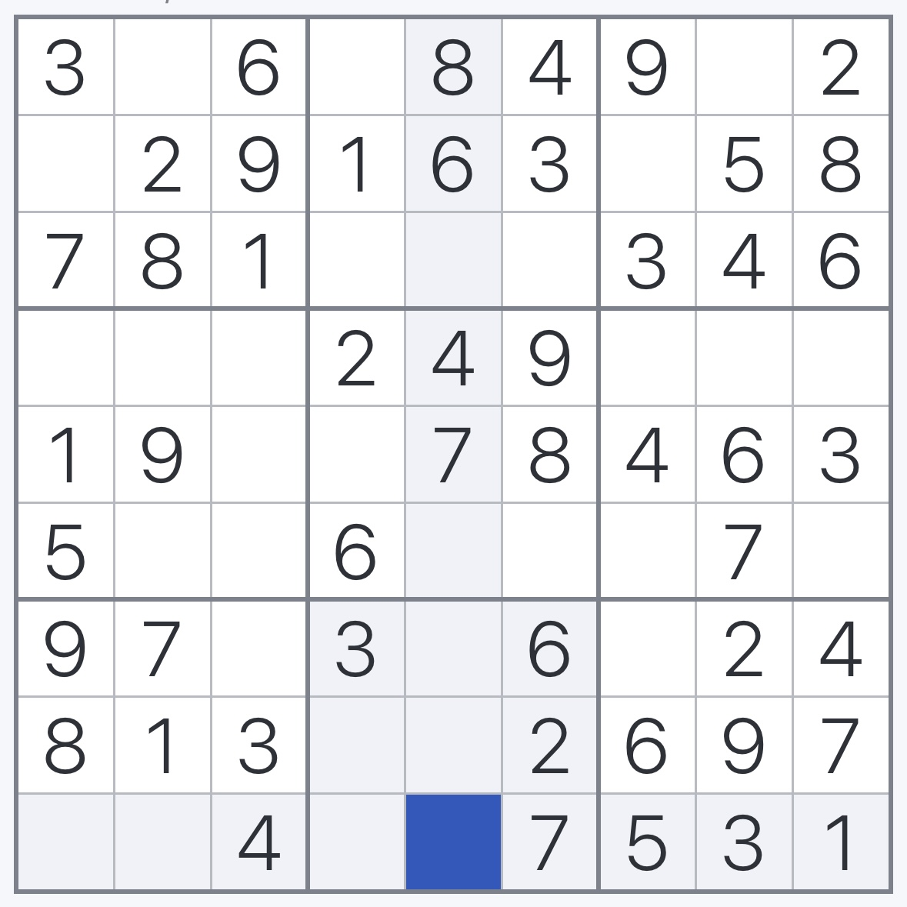

# Sudoku Solver Report

**Solved at:** 2025-06-18 18:09:21

---

## Solution Overview

The Sudoku puzzle under review was of moderate difficulty, as indicated by the solver's need for 31 recursive steps to reach the solution. The approach used was likely a constraint-focused strategy, as this typically involves recursive steps to systematically eliminate possibilities. The resolution of the puzzle was highly efficient; the solver completed it within a remarkably short time frame of 0.01 seconds. This suggests a high degree of skill in rapidly identifying and applying logical constraints.

---

## Input Image

Original image used to extract the Sudoku board.

---

## Parsed Board (Extracted from Image)

Board generated automatically via OCR and grid detection.

| 3 |   | 6 |   | 8 | 4 | 9 |   | 2 |
|---|---|---|---|---|---|---|---|---|
|   | 2 | 9 | 1 | 6 | 3 |   | 5 | 8 |
| 7 | 8 | 1 |   |   |   | 3 | 4 | 6 |
|   |   |   | 2 | 4 | 9 |   |   |   |
| 1 | 9 |   |   | 7 | 8 | 4 | 6 | 3 |
| 5 |   |   | 6 |   |   |   | 7 |   |
| 9 | 7 |   | 3 |   | 6 |   | 2 | 4 |
| 8 | 1 | 3 |   |   | 2 | 6 | 9 | 7 |
|   |   | 4 |   |   | 7 | 5 | 3 | 1 |

---

## Final Solved Board (Backtracking)

Completed Sudoku board after applying the backtracking algorithm.

| 3 | 5 | 6 | 7 | 8 | 4 | 9 | 1 | 2 |
|---|---|---|---|---|---|---|---|---|
| 4 | 2 | 9 | 1 | 6 | 3 | 7 | 5 | 8 |
| 7 | 8 | 1 | 9 | 2 | 5 | 3 | 4 | 6 |
| 6 | 3 | 7 | 2 | 4 | 9 | 1 | 8 | 5 |
| 1 | 9 | 2 | 5 | 7 | 8 | 4 | 6 | 3 |
| 5 | 4 | 8 | 6 | 3 | 1 | 2 | 7 | 9 |
| 9 | 7 | 5 | 3 | 1 | 6 | 8 | 2 | 4 |
| 8 | 1 | 3 | 4 | 5 | 2 | 6 | 9 | 7 |
| 2 | 6 | 4 | 8 | 9 | 7 | 5 | 3 | 1 |

---

## Backtracking Performance

Summary of solver performance, including total steps and execution time.

| Solved | Steps | Time (s) |
|--------|-------|----------|
| Yes | 31 | 0.0090 |