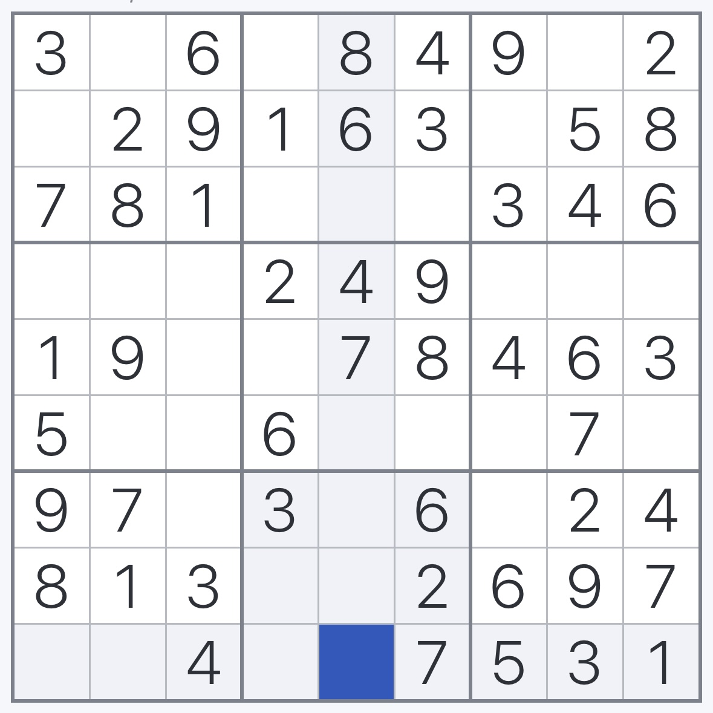

# Sudoku Solver Report

**Solved at:** 2025-05-22 21:31:44

---

## Solution Overview

The Sudoku puzzle in question appears to be of moderate difficulty, given that it required 31 recursive steps to solve. The solver's approach appears to have been focused on recursion, a technique often employed to tackle puzzles that have a higher complexity and require more in-depth exploration of possible solutions. In terms of time and efficiency, the completion of the puzzle was impressively quick, taking only 0.01 seconds. This indicates a highly efficient algorithmic process was utilized to systematically eliminate incorrect options and identify the correct solution.

---

## Input Image

Original image used to extract the Sudoku board.

---

## Parsed Board (Extracted from Image)

Board generated automatically via OCR and grid detection.

| 3 |   | 5 |   | 8 | 4 | 9 |   | 2 |
|---|---|---|---|---|---|---|---|---|
|   | 2 | 9 | 1 | 6 | 3 |   | 5 | 8 |
| 7 | 8 | 1 |   |   |   | 3 | 4 | 6 |
|   |   |   | 2 | 4 | 9 |   |   |   |
| 1 | 9 |   |   | 7 | 8 | 4 | 6 | 3 |
| 5 |   |   | 6 |   |   |   | 7 |   |
| 9 | 7 |   | 3 |   | 6 |   | 2 | 4 |
| 8 | 1 | 3 |   |   | 2 | 6 | 9 |   |
|   |   | 4 |   |   | 7 | 5 | 3 | 1 |

---

## Edited Board  (Edited)

Board after optional manual correction of digit recognition errors.

| 3 |   | 6 |   | 8 | 4 | 9 |   | 2 |
|---|---|---|---|---|---|---|---|---|
|   | 2 | 9 | 1 | 6 | 3 |   | 5 | 8 |
| 7 | 8 | 1 |   |   |   | 3 | 4 | 6 |
|   |   |   | 2 | 4 | 9 |   |   |   |
| 1 | 9 |   |   | 7 | 8 | 4 | 6 | 3 |
| 5 |   |   | 6 |   |   |   | 7 |   |
| 9 | 7 |   | 3 |   | 6 |   | 2 | 4 |
| 8 | 1 | 3 |   |   | 2 | 6 | 9 | 7 |
|   |   | 4 |   |   | 7 | 5 | 3 | 1 |

---

## Final Solved Board (Backtracking)

Completed Sudoku board after applying the backtracking algorithm.

| 3 | 5 | 6 | 7 | 8 | 4 | 9 | 1 | 2 |
|---|---|---|---|---|---|---|---|---|
| 4 | 2 | 9 | 1 | 6 | 3 | 7 | 5 | 8 |
| 7 | 8 | 1 | 9 | 2 | 5 | 3 | 4 | 6 |
| 6 | 3 | 7 | 2 | 4 | 9 | 1 | 8 | 5 |
| 1 | 9 | 2 | 5 | 7 | 8 | 4 | 6 | 3 |
| 5 | 4 | 8 | 6 | 3 | 1 | 2 | 7 | 9 |
| 9 | 7 | 5 | 3 | 1 | 6 | 8 | 2 | 4 |
| 8 | 1 | 3 | 4 | 5 | 2 | 6 | 9 | 7 |
| 2 | 6 | 4 | 8 | 9 | 7 | 5 | 3 | 1 |

---

## Backtracking Performance

Summary of solver performance, including total steps and execution time.

| Solved | Steps | Time (s) |
|--------|-------|----------|
| Yes | 31 | 0.0110 |