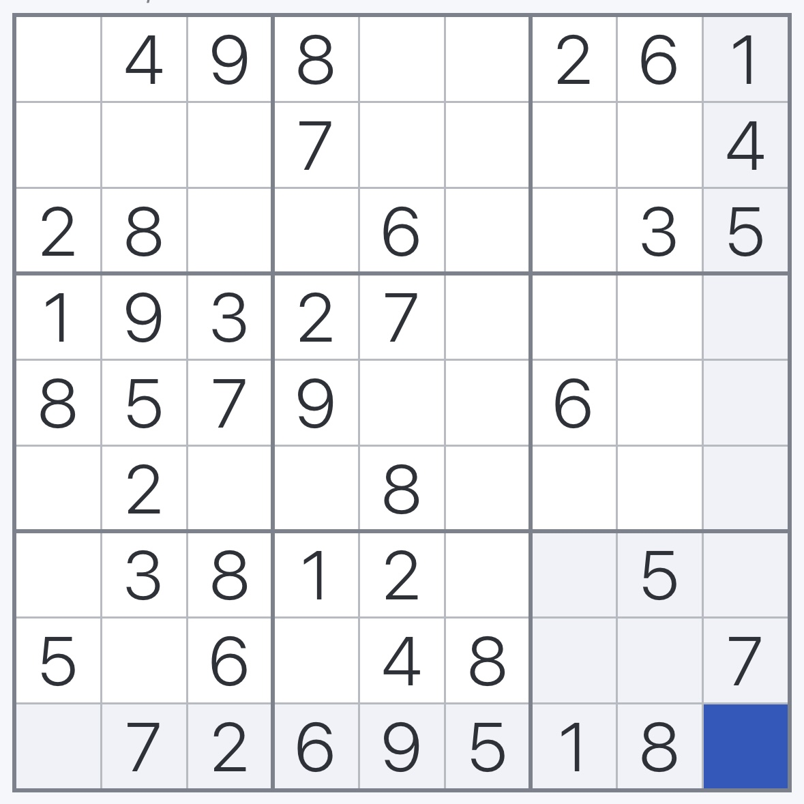

# Sudoku Solver Report

**Solved at:** 2025-05-21 19:20:46

## Input Image



---

## Parsed Board (Extracted from Image)

|   | 4 | 9 | 8 |   |   | 2 | 6 | 1 |
|---|---|---|---|---|---|---|---|---|
|   |   |   | 7 |   |   |   |   | 4 |
| 2 | 8 |   |   | 6 |   |   | 3 | 5 |
| 1 | 9 | 3 | 2 | 7 |   |   |   |   |
| 8 | 5 | 7 | 9 |   |   | 6 |   |   |
|   | 2 |   |   | 8 |   |   |   |   |
|   | 3 | 8 | 1 | 2 |   |   | 5 |   |
| 5 |   | 6 |   | 4 | 8 |   |   |   |
|   | 7 | 2 | 6 | 9 | 5 | 1 | 8 |   |

---

## Edited Board (User Corrections Applied) (Edited)

|   | 4 | 9 | 8 |   |   | 2 | 6 | 1 |
|---|---|---|---|---|---|---|---|---|
|   |   |   | 7 |   |   |   |   | 4 |
| 2 | 8 |   |   | 6 |   |   | 3 | 5 |
| 1 | 9 | 3 | 2 | 7 |   |   |   |   |
| 8 | 5 | 7 | 9 |   |   | 6 |   |   |
|   | 2 |   |   | 8 |   |   |   |   |
|   | 3 | 8 | 1 | 2 |   |   | 5 |   |
| 5 |   | 6 |   | 4 | 8 |   |   | 7 |
|   | 7 | 2 | 6 | 9 | 5 | 1 | 8 |   |

---

## Backtracking Performance

| Solved | Steps | Time (s) |
|--------|-------|----------|
| Yes | 57 | 0.0035 |
---

## Full Console Log

```bash
INFO - 📸 Loading Sudoku from: /Users/inigo/Repositorios/AISudokuSolver/inputs/medium.jpg

INFO - 

🧩 Extracted Sudoku Board:

. 4 9 | 8 . . | 2 6 1 

. . . | 7 . . | . . 4 

2 8 . | . 6 . | . 3 5 

---------------------

1 9 3 | 2 7 . | . . . 

8 5 7 | 9 . . | 6 . . 

. 2 . | . 8 . | . . . 

---------------------

. 3 8 | 1 2 . | . 5 . 

5 . 6 | . 4 8 | . . . 

. 7 2 | 6 9 5 | 1 8 . 


✏️  Do you want to edit any cell? (y/n): Enter cell coordinates to edit (format: row,col — example: 0,6): Enter digit to assign (1–9), or 0 to clear the cell: INFO - ✅ Cell updated successfully.

. 4 9 | 8 . . | 2 6 1 

. . . | 7 . . | . . 4 

2 8 . | . 6 . | . 3 5 

---------------------

1 9 3 | 2 7 . | . . . 

8 5 7 | 9 . . | 6 . . 

. 2 . | . 8 . | . . . 

---------------------

. 3 8 | 1 2 . | . 5 . 

5 . 6 | . 4 8 | . . 8 

. 7 2 | 6 9 5 | 1 8 . 


✏️  Do you want to edit any cell? (y/n): Enter cell coordinates to edit (format: row,col — example: 0,6): Enter digit to assign (1–9), or 0 to clear the cell: INFO - ✅ Cell updated successfully.

. 4 9 | 8 . . | 2 6 1 

. . . | 7 . . | . . 4 

2 8 . | . 6 . | . 3 5 

---------------------

1 9 3 | 2 7 . | . . . 

8 5 7 | 9 . . | 6 . . 

. 2 . | . 8 . | . . . 

---------------------

. 3 8 | 1 2 . | . 5 . 

5 . 6 | . 4 8 | . . 7 

. 7 2 | 6 9 5 | 1 8 . 


✏️  Do you want to edit any cell? (y/n): INFO - 

🧠 Solving with logic-based solver...

. 4 9 | 8 . . | 2 6 1 

. . . | 7 . . | . . 4 

2 8 . | . 6 . | . 3 5 

---------------------

1 9 3 | 2 7 . | . . . 

8 5 7 | 9 . . | 6 . . 

. 2 . | . 8 . | . . . 

---------------------

. 3 8 | 1 2 . | . 5 . 

5 . 6 | . 4 8 | . . 7 

. 7 2 | 6 9 5 | 1 8 . 

🔎 Trying to fill cell (0,0)

  ➤ Testing 1 at (0,0)

  ➤ Testing 2 at (0,0)

  ➤ Testing 3 at (0,0)

✅ Placed 3 at (0,0) [Step 1]

🔎 Trying to fill cell (0,4)

  ➤ Testing 1 at (0,4)

  ➤ Testing 2 at (0,4)

  ➤ Testing 3 at (0,4)

  ➤ Testing 4 at (0,4)

  ➤ Testing 5 at (0,4)

✅ Placed 5 at (0,4) [Step 2]

🔎 Trying to fill cell (0,5)

  ➤ Testing 1 at (0,5)

  ➤ Testing 2 at (0,5)

  ➤ Testing 3 at (0,5)

  ➤ Testing 4 at (0,5)

  ➤ Testing 5 at (0,5)

  ➤ Testing 6 at (0,5)

  ➤ Testing 7 at (0,5)

  ➤ Testing 8 at (0,5)

  ➤ Testing 9 at (0,5)

❌ Backtrack on (0,4), removing 5

  ➤ Testing 6 at (0,4)

  ➤ Testing 7 at (0,4)

  ➤ Testing 8 at (0,4)

  ➤ Testing 9 at (0,4)

❌ Backtrack on (0,0), removing 3

  ➤ Testing 4 at (0,0)

  ➤ Testing 5 at (0,0)

  ➤ Testing 6 at (0,0)

  ➤ Testing 7 at (0,0)

✅ Placed 7 at (0,0) [Step 3]

🔎 Trying to fill cell (0,4)

  ➤ Testing 1 at (0,4)

  ➤ Testing 2 at (0,4)

  ➤ Testing 3 at (0,4)

✅ Placed 3 at (0,4) [Step 4]

🔎 Trying to fill cell (0,5)

  ➤ Testing 1 at (0,5)

  ➤ Testing 2 at (0,5)

  ➤ Testing 3 at (0,5)

  ➤ Testing 4 at (0,5)

  ➤ Testing 5 at (0,5)

  ➤ Testing 6 at (0,5)

  ➤ Testing 7 at (0,5)

  ➤ Testing 8 at (0,5)

  ➤ Testing 9 at (0,5)

❌ Backtrack on (0,4), removing 3

  ➤ Testing 4 at (0,4)

  ➤ Testing 5 at (0,4)

✅ Placed 5 at (0,4) [Step 5]

🔎 Trying to fill cell (0,5)

  ➤ Testing 1 at (0,5)

  ➤ Testing 2 at (0,5)

  ➤ Testing 3 at (0,5)

✅ Placed 3 at (0,5) [Step 6]

🔎 Trying to fill cell (1,0)

  ➤ Testing 1 at (1,0)

  ➤ Testing 2 at (1,0)

  ➤ Testing 3 at (1,0)

✅ Placed 3 at (1,0) [Step 7]

🔎 Trying to fill cell (1,1)

  ➤ Testing 1 at (1,1)

✅ Placed 1 at (1,1) [Step 8]

🔎 Trying to fill cell (1,2)

  ➤ Testing 1 at (1,2)

  ➤ Testing 2 at (1,2)

  ➤ Testing 3 at (1,2)

  ➤ Testing 4 at (1,2)

  ➤ Testing 5 at (1,2)

✅ Placed 5 at (1,2) [Step 9]

🔎 Trying to fill cell (1,4)

  ➤ Testing 1 at (1,4)

  ➤ Testing 2 at (1,4)

  ➤ Testing 3 at (1,4)

  ➤ Testing 4 at (1,4)

  ➤ Testing 5 at (1,4)

  ➤ Testing 6 at (1,4)

  ➤ Testing 7 at (1,4)

  ➤ Testing 8 at (1,4)

  ➤ Testing 9 at (1,4)

❌ Backtrack on (1,2), removing 5

  ➤ Testing 6 at (1,2)

  ➤ Testing 7 at (1,2)

  ➤ Testing 8 at (1,2)

  ➤ Testing 9 at (1,2)

❌ Backtrack on (1,1), removing 1

  ➤ Testing 2 at (1,1)

  ➤ Testing 3 at (1,1)

  ➤ Testing 4 at (1,1)

  ➤ Testing 5 at (1,1)

  ➤ Testing 6 at (1,1)

✅ Placed 6 at (1,1) [Step 10]

🔎 Trying to fill cell (1,2)

  ➤ Testing 1 at (1,2)

✅ Placed 1 at (1,2) [Step 11]

🔎 Trying to fill cell (1,4)

  ➤ Testing 1 at (1,4)

  ➤ Testing 2 at (1,4)

  ➤ Testing 3 at (1,4)

  ➤ Testing 4 at (1,4)

  ➤ Testing 5 at (1,4)

  ➤ Testing 6 at (1,4)

  ➤ Testing 7 at (1,4)

  ➤ Testing 8 at (1,4)

  ➤ Testing 9 at (1,4)

❌ Backtrack on (1,2), removing 1

  ➤ Testing 2 at (1,2)

  ➤ Testing 3 at (1,2)

  ➤ Testing 4 at (1,2)

  ➤ Testing 5 at (1,2)

✅ Placed 5 at (1,2) [Step 12]

🔎 Trying to fill cell (1,4)

  ➤ Testing 1 at (1,4)

✅ Placed 1 at (1,4) [Step 13]

🔎 Trying to fill cell (1,5)

  ➤ Testing 1 at (1,5)

  ➤ Testing 2 at (1,5)

✅ Placed 2 at (1,5) [Step 14]

🔎 Trying to fill cell (1,6)

  ➤ Testing 1 at (1,6)

  ➤ Testing 2 at (1,6)

  ➤ Testing 3 at (1,6)

  ➤ Testing 4 at (1,6)

  ➤ Testing 5 at (1,6)

  ➤ Testing 6 at (1,6)

  ➤ Testing 7 at (1,6)

  ➤ Testing 8 at (1,6)

✅ Placed 8 at (1,6) [Step 15]

🔎 Trying to fill cell (1,7)

  ➤ Testing 1 at (1,7)

  ➤ Testing 2 at (1,7)

  ➤ Testing 3 at (1,7)

  ➤ Testing 4 at (1,7)

  ➤ Testing 5 at (1,7)

  ➤ Testing 6 at (1,7)

  ➤ Testing 7 at (1,7)

  ➤ Testing 8 at (1,7)

  ➤ Testing 9 at (1,7)

✅ Placed 9 at (1,7) [Step 16]

🔎 Trying to fill cell (2,2)

  ➤ Testing 1 at (2,2)

✅ Placed 1 at (2,2) [Step 17]

🔎 Trying to fill cell (2,3)

  ➤ Testing 1 at (2,3)

  ➤ Testing 2 at (2,3)

  ➤ Testing 3 at (2,3)

  ➤ Testing 4 at (2,3)

✅ Placed 4 at (2,3) [Step 18]

🔎 Trying to fill cell (2,5)

  ➤ Testing 1 at (2,5)

  ➤ Testing 2 at (2,5)

  ➤ Testing 3 at (2,5)

  ➤ Testing 4 at (2,5)

  ➤ Testing 5 at (2,5)

  ➤ Testing 6 at (2,5)

  ➤ Testing 7 at (2,5)

  ➤ Testing 8 at (2,5)

  ➤ Testing 9 at (2,5)

✅ Placed 9 at (2,5) [Step 19]

🔎 Trying to fill cell (2,6)

  ➤ Testing 1 at (2,6)

  ➤ Testing 2 at (2,6)

  ➤ Testing 3 at (2,6)

  ➤ Testing 4 at (2,6)

  ➤ Testing 5 at (2,6)

  ➤ Testing 6 at (2,6)

  ➤ Testing 7 at (2,6)

✅ Placed 7 at (2,6) [Step 20]

🔎 Trying to fill cell (3,5)

  ➤ Testing 1 at (3,5)

  ➤ Testing 2 at (3,5)

  ➤ Testing 3 at (3,5)

  ➤ Testing 4 at (3,5)

✅ Placed 4 at (3,5) [Step 21]

🔎 Trying to fill cell (3,6)

  ➤ Testing 1 at (3,6)

  ➤ Testing 2 at (3,6)

  ➤ Testing 3 at (3,6)

  ➤ Testing 4 at (3,6)

  ➤ Testing 5 at (3,6)

✅ Placed 5 at (3,6) [Step 22]

🔎 Trying to fill cell (3,7)

  ➤ Testing 1 at (3,7)

  ➤ Testing 2 at (3,7)

  ➤ Testing 3 at (3,7)

  ➤ Testing 4 at (3,7)

  ➤ Testing 5 at (3,7)

  ➤ Testing 6 at (3,7)

  ➤ Testing 7 at (3,7)

  ➤ Testing 8 at (3,7)

  ➤ Testing 9 at (3,7)

❌ Backtrack on (3,6), removing 5

  ➤ Testing 6 at (3,6)

  ➤ Testing 7 at (3,6)

  ➤ Testing 8 at (3,6)

  ➤ Testing 9 at (3,6)

❌ Backtrack on (3,5), removing 4

  ➤ Testing 5 at (3,5)

  ➤ Testing 6 at (3,5)

✅ Placed 6 at (3,5) [Step 23]

🔎 Trying to fill cell (3,6)

  ➤ Testing 1 at (3,6)

  ➤ Testing 2 at (3,6)

  ➤ Testing 3 at (3,6)

  ➤ Testing 4 at (3,6)

✅ Placed 4 at (3,6) [Step 24]

🔎 Trying to fill cell (3,7)

  ➤ Testing 1 at (3,7)

  ➤ Testing 2 at (3,7)

  ➤ Testing 3 at (3,7)

  ➤ Testing 4 at (3,7)

  ➤ Testing 5 at (3,7)

  ➤ Testing 6 at (3,7)

  ➤ Testing 7 at (3,7)

  ➤ Testing 8 at (3,7)

  ➤ Testing 9 at (3,7)

❌ Backtrack on (3,6), removing 4

  ➤ Testing 5 at (3,6)

✅ Placed 5 at (3,6) [Step 25]

🔎 Trying to fill cell (3,7)

  ➤ Testing 1 at (3,7)

  ➤ Testing 2 at (3,7)

  ➤ Testing 3 at (3,7)

  ➤ Testing 4 at (3,7)

✅ Placed 4 at (3,7) [Step 26]

🔎 Trying to fill cell (3,8)

  ➤ Testing 1 at (3,8)

  ➤ Testing 2 at (3,8)

  ➤ Testing 3 at (3,8)

  ➤ Testing 4 at (3,8)

  ➤ Testing 5 at (3,8)

  ➤ Testing 6 at (3,8)

  ➤ Testing 7 at (3,8)

  ➤ Testing 8 at (3,8)

✅ Placed 8 at (3,8) [Step 27]

🔎 Trying to fill cell (4,4)

  ➤ Testing 1 at (4,4)

  ➤ Testing 2 at (4,4)

  ➤ Testing 3 at (4,4)

✅ Placed 3 at (4,4) [Step 28]

🔎 Trying to fill cell (4,5)

  ➤ Testing 1 at (4,5)

✅ Placed 1 at (4,5) [Step 29]

🔎 Trying to fill cell (4,7)

  ➤ Testing 1 at (4,7)

  ➤ Testing 2 at (4,7)

✅ Placed 2 at (4,7) [Step 30]

🔎 Trying to fill cell (4,8)

  ➤ Testing 1 at (4,8)

  ➤ Testing 2 at (4,8)

  ➤ Testing 3 at (4,8)

  ➤ Testing 4 at (4,8)

  ➤ Testing 5 at (4,8)

  ➤ Testing 6 at (4,8)

  ➤ Testing 7 at (4,8)

  ➤ Testing 8 at (4,8)

  ➤ Testing 9 at (4,8)

❌ Backtrack on (4,7), removing 2

  ➤ Testing 3 at (4,7)

  ➤ Testing 4 at (4,7)

  ➤ Testing 5 at (4,7)

  ➤ Testing 6 at (4,7)

  ➤ Testing 7 at (4,7)

  ➤ Testing 8 at (4,7)

  ➤ Testing 9 at (4,7)

❌ Backtrack on (4,5), removing 1

  ➤ Testing 2 at (4,5)

  ➤ Testing 3 at (4,5)

  ➤ Testing 4 at (4,5)

✅ Placed 4 at (4,5) [Step 31]

🔎 Trying to fill cell (4,7)

  ➤ Testing 1 at (4,7)

✅ Placed 1 at (4,7) [Step 32]

🔎 Trying to fill cell (4,8)

  ➤ Testing 1 at (4,8)

  ➤ Testing 2 at (4,8)

✅ Placed 2 at (4,8) [Step 33]

🔎 Trying to fill cell (5,0)

  ➤ Testing 1 at (5,0)

  ➤ Testing 2 at (5,0)

  ➤ Testing 3 at (5,0)

  ➤ Testing 4 at (5,0)

✅ Placed 4 at (5,0) [Step 34]

🔎 Trying to fill cell (5,2)

  ➤ Testing 1 at (5,2)

  ➤ Testing 2 at (5,2)

  ➤ Testing 3 at (5,2)

  ➤ Testing 4 at (5,2)

  ➤ Testing 5 at (5,2)

  ➤ Testing 6 at (5,2)

  ➤ Testing 7 at (5,2)

  ➤ Testing 8 at (5,2)

  ➤ Testing 9 at (5,2)

❌ Backtrack on (5,0), removing 4

  ➤ Testing 5 at (5,0)

  ➤ Testing 6 at (5,0)

✅ Placed 6 at (5,0) [Step 35]

🔎 Trying to fill cell (5,2)

  ➤ Testing 1 at (5,2)

  ➤ Testing 2 at (5,2)

  ➤ Testing 3 at (5,2)

  ➤ Testing 4 at (5,2)

✅ Placed 4 at (5,2) [Step 36]

🔎 Trying to fill cell (5,3)

  ➤ Testing 1 at (5,3)

  ➤ Testing 2 at (5,3)

  ➤ Testing 3 at (5,3)

  ➤ Testing 4 at (5,3)

  ➤ Testing 5 at (5,3)

✅ Placed 5 at (5,3) [Step 37]

🔎 Trying to fill cell (5,5)

  ➤ Testing 1 at (5,5)

✅ Placed 1 at (5,5) [Step 38]

🔎 Trying to fill cell (5,6)

  ➤ Testing 1 at (5,6)

  ➤ Testing 2 at (5,6)

  ➤ Testing 3 at (5,6)

✅ Placed 3 at (5,6) [Step 39]

🔎 Trying to fill cell (5,7)

  ➤ Testing 1 at (5,7)

  ➤ Testing 2 at (5,7)

  ➤ Testing 3 at (5,7)

  ➤ Testing 4 at (5,7)

  ➤ Testing 5 at (5,7)

  ➤ Testing 6 at (5,7)

  ➤ Testing 7 at (5,7)

✅ Placed 7 at (5,7) [Step 40]

🔎 Trying to fill cell (5,8)

  ➤ Testing 1 at (5,8)

  ➤ Testing 2 at (5,8)

  ➤ Testing 3 at (5,8)

  ➤ Testing 4 at (5,8)

  ➤ Testing 5 at (5,8)

  ➤ Testing 6 at (5,8)

  ➤ Testing 7 at (5,8)

  ➤ Testing 8 at (5,8)

  ➤ Testing 9 at (5,8)

✅ Placed 9 at (5,8) [Step 41]

🔎 Trying to fill cell (6,0)

  ➤ Testing 1 at (6,0)

  ➤ Testing 2 at (6,0)

  ➤ Testing 3 at (6,0)

  ➤ Testing 4 at (6,0)

✅ Placed 4 at (6,0) [Step 42]

🔎 Trying to fill cell (6,5)

  ➤ Testing 1 at (6,5)

  ➤ Testing 2 at (6,5)

  ➤ Testing 3 at (6,5)

  ➤ Testing 4 at (6,5)

  ➤ Testing 5 at (6,5)

  ➤ Testing 6 at (6,5)

  ➤ Testing 7 at (6,5)

✅ Placed 7 at (6,5) [Step 43]

🔎 Trying to fill cell (6,6)

  ➤ Testing 1 at (6,6)

  ➤ Testing 2 at (6,6)

  ➤ Testing 3 at (6,6)

  ➤ Testing 4 at (6,6)

  ➤ Testing 5 at (6,6)

  ➤ Testing 6 at (6,6)

  ➤ Testing 7 at (6,6)

  ➤ Testing 8 at (6,6)

  ➤ Testing 9 at (6,6)

✅ Placed 9 at (6,6) [Step 44]

🔎 Trying to fill cell (6,8)

  ➤ Testing 1 at (6,8)

  ➤ Testing 2 at (6,8)

  ➤ Testing 3 at (6,8)

  ➤ Testing 4 at (6,8)

  ➤ Testing 5 at (6,8)

  ➤ Testing 6 at (6,8)

✅ Placed 6 at (6,8) [Step 45]

🔎 Trying to fill cell (7,1)

  ➤ Testing 1 at (7,1)

✅ Placed 1 at (7,1) [Step 46]

🔎 Trying to fill cell (7,3)

  ➤ Testing 1 at (7,3)

  ➤ Testing 2 at (7,3)

  ➤ Testing 3 at (7,3)

✅ Placed 3 at (7,3) [Step 47]

🔎 Trying to fill cell (7,6)

  ➤ Testing 1 at (7,6)

  ➤ Testing 2 at (7,6)

  ➤ Testing 3 at (7,6)

  ➤ Testing 4 at (7,6)

  ➤ Testing 5 at (7,6)

  ➤ Testing 6 at (7,6)

  ➤ Testing 7 at (7,6)

  ➤ Testing 8 at (7,6)

  ➤ Testing 9 at (7,6)

❌ Backtrack on (7,3), removing 3

  ➤ Testing 4 at (7,3)

  ➤ Testing 5 at (7,3)

  ➤ Testing 6 at (7,3)

  ➤ Testing 7 at (7,3)

  ➤ Testing 8 at (7,3)

  ➤ Testing 9 at (7,3)

❌ Backtrack on (7,1), removing 1

  ➤ Testing 2 at (7,1)

  ➤ Testing 3 at (7,1)

  ➤ Testing 4 at (7,1)

  ➤ Testing 5 at (7,1)

  ➤ Testing 6 at (7,1)

  ➤ Testing 7 at (7,1)

  ➤ Testing 8 at (7,1)

  ➤ Testing 9 at (7,1)

❌ Backtrack on (6,8), removing 6

  ➤ Testing 7 at (6,8)

  ➤ Testing 8 at (6,8)

  ➤ Testing 9 at (6,8)

❌ Backtrack on (6,6), removing 9

❌ Backtrack on (6,5), removing 7

  ➤ Testing 8 at (6,5)

  ➤ Testing 9 at (6,5)

❌ Backtrack on (6,0), removing 4

  ➤ Testing 5 at (6,0)

  ➤ Testing 6 at (6,0)

  ➤ Testing 7 at (6,0)

  ➤ Testing 8 at (6,0)

  ➤ Testing 9 at (6,0)

✅ Placed 9 at (6,0) [Step 48]

🔎 Trying to fill cell (6,5)

  ➤ Testing 1 at (6,5)

  ➤ Testing 2 at (6,5)

  ➤ Testing 3 at (6,5)

  ➤ Testing 4 at (6,5)

  ➤ Testing 5 at (6,5)

  ➤ Testing 6 at (6,5)

  ➤ Testing 7 at (6,5)

✅ Placed 7 at (6,5) [Step 49]

🔎 Trying to fill cell (6,6)

  ➤ Testing 1 at (6,6)

  ➤ Testing 2 at (6,6)

  ➤ Testing 3 at (6,6)

  ➤ Testing 4 at (6,6)

✅ Placed 4 at (6,6) [Step 50]

🔎 Trying to fill cell (6,8)

  ➤ Testing 1 at (6,8)

  ➤ Testing 2 at (6,8)

  ➤ Testing 3 at (6,8)

  ➤ Testing 4 at (6,8)

  ➤ Testing 5 at (6,8)

  ➤ Testing 6 at (6,8)

✅ Placed 6 at (6,8) [Step 51]

🔎 Trying to fill cell (7,1)

  ➤ Testing 1 at (7,1)

✅ Placed 1 at (7,1) [Step 52]

🔎 Trying to fill cell (7,3)

  ➤ Testing 1 at (7,3)

  ➤ Testing 2 at (7,3)

  ➤ Testing 3 at (7,3)

✅ Placed 3 at (7,3) [Step 53]

🔎 Trying to fill cell (7,6)

  ➤ Testing 1 at (7,6)

  ➤ Testing 2 at (7,6)

  ➤ Testing 3 at (7,6)

  ➤ Testing 4 at (7,6)

  ➤ Testing 5 at (7,6)

  ➤ Testing 6 at (7,6)

  ➤ Testing 7 at (7,6)

  ➤ Testing 8 at (7,6)

  ➤ Testing 9 at (7,6)

✅ Placed 9 at (7,6) [Step 54]

🔎 Trying to fill cell (7,7)

  ➤ Testing 1 at (7,7)

  ➤ Testing 2 at (7,7)

✅ Placed 2 at (7,7) [Step 55]

🔎 Trying to fill cell (8,0)

  ➤ Testing 1 at (8,0)

  ➤ Testing 2 at (8,0)

  ➤ Testing 3 at (8,0)

  ➤ Testing 4 at (8,0)

✅ Placed 4 at (8,0) [Step 56]

🔎 Trying to fill cell (8,8)

  ➤ Testing 1 at (8,8)

  ➤ Testing 2 at (8,8)

  ➤ Testing 3 at (8,8)

✅ Placed 3 at (8,8) [Step 57]

INFO - 🧠 Steps taken: 57

INFO - ⏱️ Time taken: 0.0035 seconds

INFO - 

✅ Logic Solver: Puzzle solved!

7 4 9 | 8 5 3 | 2 6 1 

3 6 5 | 7 1 2 | 8 9 4 

2 8 1 | 4 6 9 | 7 3 5 

---------------------

1 9 3 | 2 7 6 | 5 4 8 

8 5 7 | 9 3 4 | 6 1 2 

6 2 4 | 5 8 1 | 3 7 9 

---------------------

9 3 8 | 1 2 7 | 4 5 6 

5 1 6 | 3 4 8 | 9 2 7 

4 7 2 | 6 9 5 | 1 8 3 

```